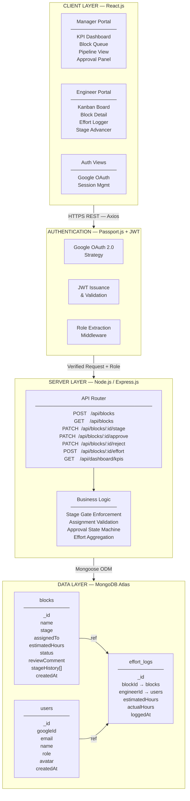
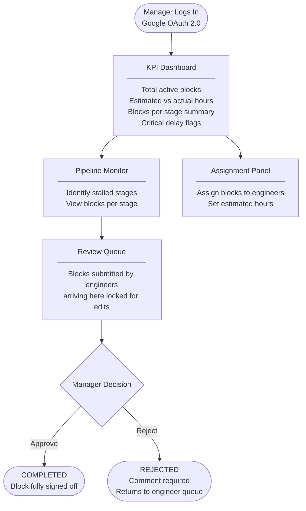
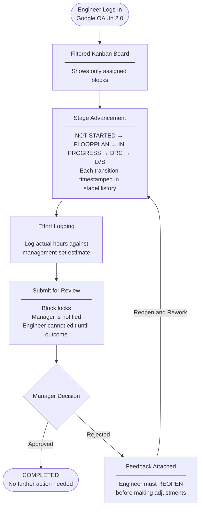
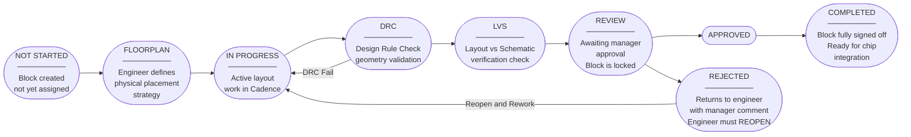

<p align="center">
  
</p>

<h1 align="center">VLSI/ASIC Design Workflow Management System</h1>

<p align="center">
  A domain-specific project management platform engineered for semiconductor physical design teams.
  <br />
  Built to replace spreadsheet-driven coordination with a structured, real-time, role-aware workflow engine.
</p>

<p align="center">
  
  
  
  
  
</p>

---

## Table of Contents

- [Motivation](#motivation)
- [Problem Statement](#problem-statement)
- [System Architecture](#system-architecture)
- [Application Workflow](#application-workflow)
- [Block Lifecycle](#block-lifecycle)
- [Technology Stack](#technology-stack)
- [Project Structure](#project-structure)
- [Getting Started](#getting-started)
- [Environment Variables](#environment-variables)
- [API Reference](#api-reference)
- [Role-Based Access Control](#role-based-access-control)
- [Team](#team)

---

## Motivation

In semiconductor chip design (VLSI/ASIC), the physical layout of a microchip is divided into many discrete architectural blocks. Each block must be meticulously designed and pass stringent verification checks — including Design Rule Checks (DRC) and Layout Versus Schematic (LVS) — before the entire chip can be integrated and submitted for fabrication.

Large engineering teams struggle to coordinate this effort at scale. Generic project management tools such as Jira or Trello lack the domain-specific vocabulary and workflow enforcement required for physical design work. They do not understand the concept of a DRC-clean block, they cannot enforce stage-gated advancement through a verification pipeline, and they offer no mechanism for structured manager approval tied to domain artifacts.

This platform replaces spreadsheet-driven coordination with a purpose-built system that speaks the language of semiconductor engineers while giving managers high-level, real-time visibility into pipeline health, resource allocation, and critical delays.

---

## Problem Statement

Current analog and mixed-signal layout teams manage all coordination through shared Excel files and email threads. This approach creates four systemic failures at scale:

| Problem | Impact |
|---|---|
| No real-time pipeline visibility | Blocks stall silently at DRC or LVS with no automated alerting |
| Disconnected effort tracking | Estimated vs. actual hours are not tied to design artifacts; capacity planning is imprecise |
| Fragmented approval processes | Manager sign-offs happen over email, creating untraceable bottlenecks |
| Resource misallocation | No mechanism to detect double-assignment or identify unassigned critical blocks |

---

## System Architecture

The system follows a three-tier MERN architecture with a dedicated authentication layer using Google OAuth 2.0 and role-based middleware protecting all API routes.

### Architecture Diagram



### Tier Responsibilities

| Tier | Technology | Responsibility |
|---|---|---|
| Client | React.js + Context API | Role-aware UI rendering, HTTP communication via Axios |
| Auth | Passport.js + JWT | Google identity verification, token issuance, role-based route guards |
| Server | Node.js + Express.js | Business logic, stage gate enforcement, approval state machine |
| Data | MongoDB + Mongoose | Persistent storage of blocks, users, and effort logs with schema validation |

---

## Application Workflow

The platform enforces two separate workflows depending on the authenticated user's role.

### Manager Workflow



### Engineer Workflow



---

## Block Lifecycle

Every design block moves through a strict, ordered pipeline. Stages cannot be skipped. The state machine is enforced at the API layer.



---

## Technology Stack

| Layer | Technology | Purpose |
|---|---|---|
| Frontend | React.js 18 | Component-based UI, role-aware rendering |
| State Management | React Context API | Global auth state and user session |
| HTTP Client | Axios | REST API communication with interceptors |
| Backend | Node.js + Express.js | REST API server, middleware pipeline |
| Authentication | Passport.js + Google OAuth 2.0 | Identity verification and session management |
| Authorization | JWT (JSON Web Tokens) | Stateless role-based route protection |
| Database | MongoDB Atlas | Document storage for blocks, users, effort logs |
| ODM | Mongoose | Schema enforcement and query abstraction |
| Environment | dotenv | Secrets and configuration management |

---

## Project Structure

```
vlsi-workflow-system/
|
+-- client/                          # React.js frontend
|   +-- public/
|   |   +-- index.html
|   +-- src/
|       +-- assets/
|       |   +-- banner.png
|       +-- components/
|       |   +-- Board/               # Kanban board components
|       |   +-- Dashboard/           # KPI and analytics panels
|       |   +-- Block/               # Block detail and stage controls
|       |   +-- Common/              # Shared UI components
|       +-- context/
|       |   +-- AuthContext.js       # Global authentication state
|       +-- hooks/
|       |   +-- useBlocks.js
|       |   +-- useEffortLog.js
|       +-- pages/
|       |   +-- ManagerDashboard.jsx
|       |   +-- EngineerDashboard.jsx
|       |   +-- Login.jsx
|       +-- services/
|       |   +-- api.js               # Axios instance with auth headers
|       +-- App.jsx
|       +-- main.jsx
|
+-- server/                          # Node.js / Express backend
|   +-- config/
|   |   +-- passport.js              # Google OAuth strategy
|   |   +-- db.js                    # MongoDB connection
|   +-- controllers/
|   |   +-- blockController.js
|   |   +-- userController.js
|   |   +-- dashboardController.js
|   +-- middleware/
|   |   +-- authenticate.js          # JWT verification
|   |   +-- authorize.js             # Role-based access guard
|   +-- models/
|   |   +-- Block.js
|   |   +-- User.js
|   |   +-- EffortLog.js
|   +-- routes/
|   |   +-- auth.js
|   |   +-- blocks.js
|   |   +-- users.js
|   |   +-- dashboard.js
|   +-- utils/
|   |   +-- stageValidator.js        # Stage transition enforcement
|   +-- app.js
|   +-- server.js
|
+-- .env.example
+-- .gitignore
+-- package.json
+-- README.md
```

---

## Getting Started

### Prerequisites

- Node.js >= 18.x
- npm >= 9.x
- MongoDB Atlas account (or local MongoDB instance)
- Google Cloud Console project with OAuth 2.0 credentials

### Installation

1. Clone the repository:

```bash
git clone https://github.com/tech-rockers/vlsi-workflow-system.git
cd vlsi-workflow-system
```

2. Install server dependencies:

```bash
cd server
npm install
```

3. Install client dependencies:

```bash
cd ../client
npm install
```

4. Configure environment variables (see [Environment Variables](#environment-variables)):

```bash
cp .env.example .env
# Edit .env with your credentials
```

5. Start the development servers:

```bash
# Terminal 1 — Backend
cd server
npm run dev

# Terminal 2 — Frontend
cd client
npm run dev
```

The client will be available at `http://localhost:5173` and the API server at `http://localhost:5000`.

---

## Environment Variables

Create a `.env` file in the `/server` directory based on the following template:

```env
# Server
PORT=5000
NODE_ENV=development

# MongoDB
MONGO_URI=mongodb+srv://<username>:<password>@cluster.mongodb.net/vlsi-workflow

# Google OAuth 2.0
GOOGLE_CLIENT_ID=your_google_client_id
GOOGLE_CLIENT_SECRET=your_google_client_secret
GOOGLE_CALLBACK_URL=http://localhost:5000/api/auth/google/callback

# JWT
JWT_SECRET=your_jwt_secret_key
JWT_EXPIRES_IN=7d

# Client Origin (for CORS)
CLIENT_ORIGIN=http://localhost:5173
```

---

## API Reference

All routes are prefixed with `/api`. Protected routes require a valid JWT in the `Authorization: Bearer <token>` header.

| Method | Endpoint | Role Required | Description |
|---|---|---|---|
| GET | `/auth/google` | Public | Initiate Google OAuth flow |
| GET | `/auth/google/callback` | Public | OAuth callback, returns JWT |
| GET | `/blocks` | Engineer, Manager | List all blocks (filtered by role) |
| POST | `/blocks` | Manager | Create a new design block |
| GET | `/blocks/:id` | Engineer, Manager | Get single block detail |
| PATCH | `/blocks/:id/assign` | Manager | Assign engineer and set estimated hours |
| PATCH | `/blocks/:id/stage` | Engineer | Advance block to next stage |
| POST | `/blocks/:id/effort` | Engineer | Log actual hours against estimate |
| PATCH | `/blocks/:id/submit` | Engineer | Submit block for manager review |
| PATCH | `/blocks/:id/reopen` | Engineer | Reopen a rejected block |
| PATCH | `/blocks/:id/approve` | Manager | Approve block, mark as completed |
| PATCH | `/blocks/:id/reject` | Manager | Reject block with required comment |
| GET | `/dashboard/kpis` | Manager | Aggregate KPI metrics |
| GET | `/users` | Manager | List all engineers |

---

## Role-Based Access Control

Two roles are supported. Role assignment is determined at account creation and stored on the user document.

| Capability | Engineer | Manager |
|---|---|---|
| View own assigned blocks | Yes | Yes |
| View all blocks | No | Yes |
| Create blocks | No | Yes |
| Assign engineers to blocks | No | Yes |
| Advance block stage | Yes | No |
| Log effort hours | Yes | No |
| Submit block for review | Yes | No |
| Approve or reject blocks | No | Yes |
| Access KPI dashboard | No | Yes |
| View all engineers | No | Yes |

---

## Team

**tech_rockers**

This system was designed and developed by team tech_rockers as part of the VLSI/ASIC Workflow Automation Hackathon.

---

<p align="center">
  Developed by <strong>tech_rockers</strong>
</p>
